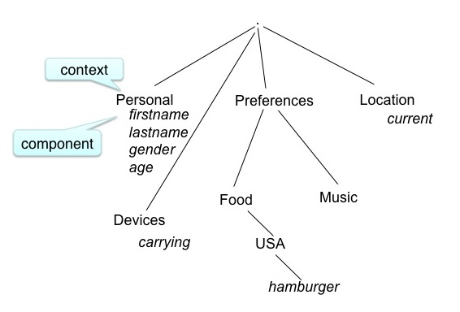
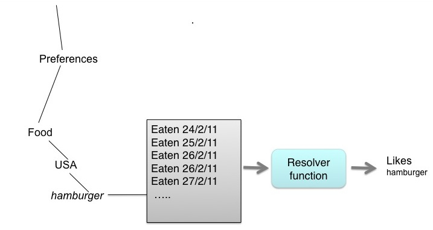

Introduction
============

A simple definition of a user model is that it is a 
collection and categorization of personal data associated with a specific user. 
This collection of data is stored in a persistent data structure and made available to 
applications to allow personalisation of systems.  
The philosophy of the Personis system is that the user should own their model and have complete access and control over their
data. Also, the data stored represents attributes of the user and isn't specific to applications.

Data about the user is stored in a tree-like structure where the leaves contain information about some attribute of the user, 
for example their name, or their weight, or icecream flavour preference.  In Personis the leaves are called *components* of the model.

  * Scrutability and user control
  
When an application needs to know information from the model, it *asks* the model for the value of the 
required component or set of components.
The *ask* process involves using a filter to select the evidence to be considered (eg only values after 2010)
and then running a *resolver* functions to interpret the filtered evidence and return a single value.
The application may specify the filter and resolver functions from those that are installed in the system.
Or the default filter and resolver may be used.
These functions can be very simple (eg a point query specifying the last piece of evidence)  
or arbitrarily sophisticated (eg use Bayesian model, ontology.)

This approaches allows multiple interpreations of the data by any application.

The accretion/resolution technique is a key part of the Personis philosophy.

Another important part of the Personis architecture is *scrutability*: the data is apable of being 
understood through study and observation, the data is comprehensible. 
This allows us to answer question such as:
    * Where does the system think I am, and why?
    * Historic queries: what location did the system think I was on May 1st 2001?
    * what music does the system think I like and why?

**Model Structure**

In Personis the model is represented as a tree. The branches are called *contexts* and the leaves *components*.
For example:

The *components* of a model contain the evidence associated with that attribute. 
For models of users the components might represent physical atributes, or they might represent
more abstract information such as a users' knowledge, their beliefs, their goals, or their preferences.
Personis is also used in pervasive computing applications to model devices, sensors, spaces etc.
In this caes the components might contain information such as sensor readings or location.

The basic operations in Personis are *ask* and *tell*. Evidence is added to a component (accreted) using
the *tell* operation:

.. image:: accretion.jpg

Component values are retrieved from the nodel using an *ask* operation. A *resolver* function examines
filtered evidence from the component to determine a value:
  

A key advantage of the accretion/resolution system is that values are only calculated from the 
evidence when they are needed, rather than whenever a new data point (evidence) is received.
The choice of resolver function allows flexibility in the calculated values. For example, location may be resolved as:
  
    * room 123, or "at work", or latitude/longitude

Historic queries are possible, for example: Where was I on a certain date? How have my music preferences changed over time?

The choice of filter function allows appropriate evidence for the query to be used. For example, one evidence source may be known
to be unreliable and so that evidence should not be considered. For historical queries only evidence for a particular period might be 
resolved.
  
